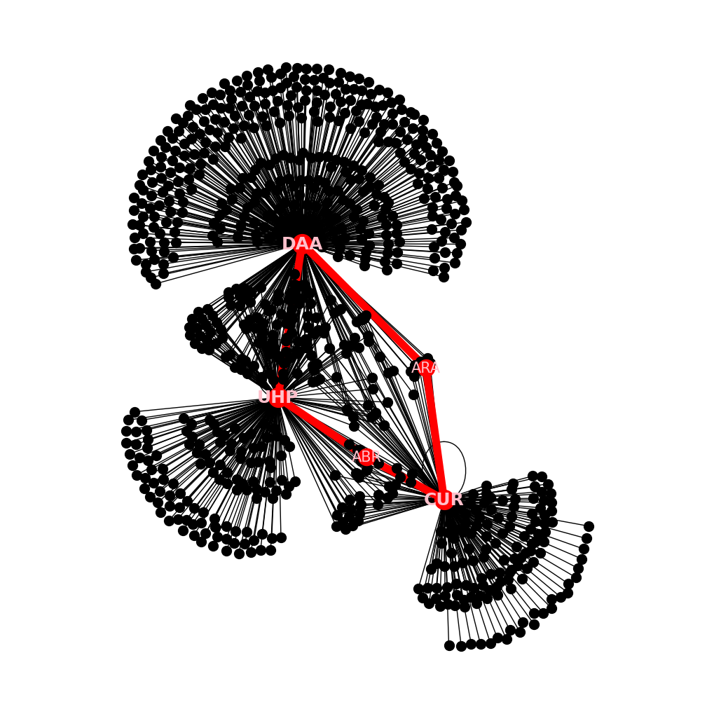

# 🚉 NetRail
### *Charting the rails of India through Nodes and Edges*

---

## 📌 Project Overview

**NetRials** is a an exploration of the **Indian Railways Network** using station and route data. By modeling the railway system as a graph of stations (nodes) and connections (edges), this project uncovers insights like network connectivity, central hubs, shortest paths, and critical nodes that influence the efficiency of train travel across India.


---

## 📂 Dataset

- **Source:** [Open Government Data (OGD) Platform India](https://data.gov.in)
- **Data Used:** Train stations and train routes dataset  
- **Format:** CSV files processed into a graph structure using NetworkX

---

## 📊 Visualizations

Here are some visual outputs from our network analysis:




---

## 🧠 Key Insights

- Highly central stations like **Delhi**, **Mumbai**, and **Howrah** dominate in terms of connectivity.
- The Indian Railways network exhibits **small-world properties**, ensuring efficient travel paths across the country.
- **Betweenness centrality** highlights the stations that serve as crucial bridges between regions.

---

## ⚙️ Technologies Used

- 🐍 Python 3
- 🔗 NetworkX
- 📊 Matplotlib & Seaborn
- 📍 Geopandas (optional, for geo-visualization)
- 📁 Pandas
- bookeh
  

---

## 🚀 Installation

```bash
git clone https://github.com/your-username/NetRail.git
cd NetRail
pip install -r requirements.txt
